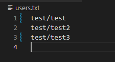

# KTH Passwordsystem

## Description

This program is written in python. It is a account creator and log in system made to simulate a working account creator with the function to track who has tried to log onto your account. Since it has no form of security it is not recommended to use in a serious matter.

## Technology/Languages/Built with

- Python - The whole program
- Markdown - This description file

## Requirements/Prerequisites 

- Python 3.9+

## Installation

Exempel 1: 

1. Klona repot
```cmd
    git clone https://github.com/ditt_anv/reponamn
```
2. Installera Flask
```cmd
pip install Flask
```
3. Installera pygame
```cmd
pip install pygame
```

Exempel 2:

Detta projekt är testat på Python 3.7+. För att installera Python kan du besöka (https://www.python.org/downloads/)[följande länk för senaste versionen.]

Programmet kräver även att biblioteket Flask samt pygame är installerade. För att installera krävs python 3.7+ installerat, följt av att följande kodrader skrivs i terminalen: 

```cmd
pip install Flask
pip install pygame
```

## Code conventions

File structure does not matter, the important thing is the filenames. The logging file should be named "log.txt" and the user file should be named "users.txt". If this were to be changed, it has to be changed everywhere it is used in the code too. The program is written following PEP8.

## How it works

Users are saved as username/password in the "users.txt" file

It is possible to have the same username as someone else as you could see on the screenshot. This is a problem, but it does not matter for this purpose.

Log is saved like this (see screenshot below) in the "log.txt" file


This is how easy it is to change password:


## Example run
What do you want to do?
login: Log in
reg: Register
 To end, write anything else.
Write the command in the beginning of the alternatives: login

Enter your username: test
Enter your password: test
You're now logged in!

What do you want to do?
log: See account activity
passwd: Change password
logout: log out
 To end, write anything else.
Write the command in the beginning of the alternatives: logout
What do you want to do?
login: Log in
reg: Register
 To end, write anything else.
Write the command in the beginning of the alternatives: o
The program ended.

## To do/Roadmap

- [x] Working login
- [x] Working register
- [x] Passwordchanging
- [ ] Usernamechanging
- [ ] Individual log file
- [ ] Log with date
- [ ] Remove account
- [x] English
- [ ] Languages


## Contribution

Since this is a program made as a school project it has not been graded yet, no pull requests are allowed. As soon as it has been graded, this will be allowed.

In the event of major changes, I want an issue to be opened up for discussion about what should be changed.

## License

[MIT](https://choosealicense.com/licenses/mit/)

## Contact

Albin EKlund - Instagram: @u_know_affe - Discord: bb2100#4433

Projektlänk: https://github.com/bb2100/KTH-118-L-senordssystem

## Acknowledgments

- Niclas Lund
- [The task](https://www.csc.kth.se/utbildning/kth/kurser/DD1310/prgs14/P/118.pdf)
